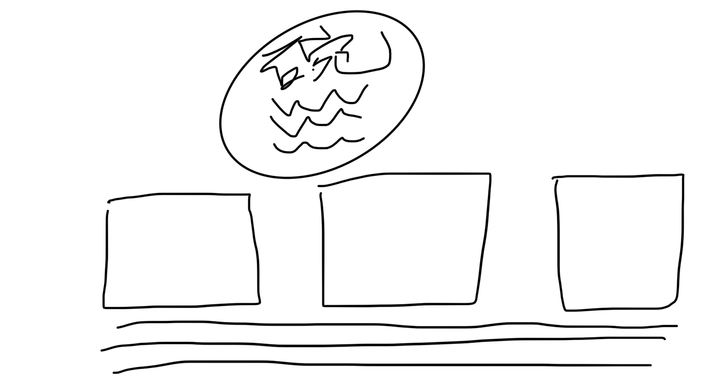
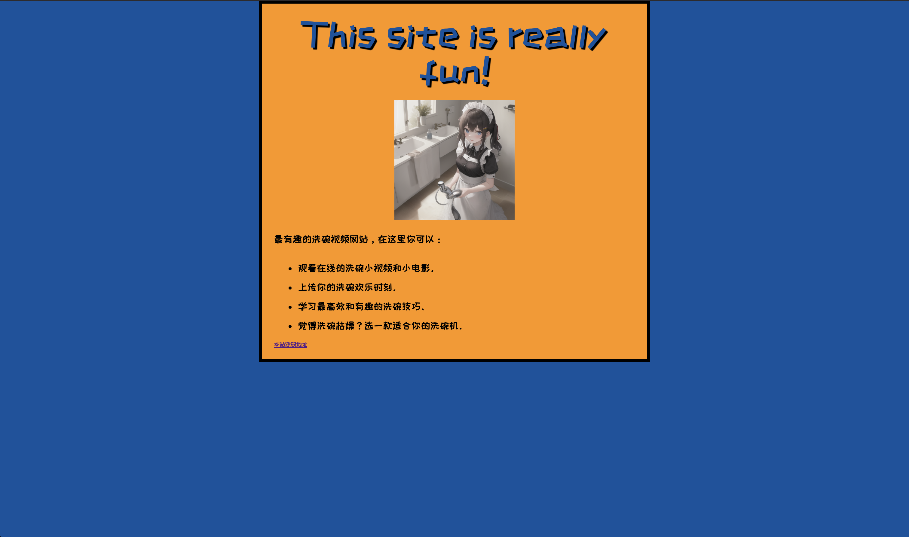

# interesting-dishwashing-video-site
一个可以用来上传最有意思的洗碗教程个人网站。

## 第一步：计划

首先，请考虑以下问题：

1. **网站的主题是什么？** 我喜欢研究如何在洗碗的时候保持欢乐，以及如何高效的洗碗，可能还包括洗碗机的原理和购买建议。
2. **基于所选主题要展示哪些信息？** 我的网站标题是“最欢乐的洗碗视频”，接下来是一些视频和一些文档。
3. **网站采用怎样的外观？** 用高阶术语来说，背景颜色是什么？使用哪种字体比较合适：正式的、卡通的、粗体、瘦体？

我的网站也需要保证欢乐，可以选择一些鲜艳明亮的色彩，让人眼前一亮。选择卡通的字体也会让人感觉有趣。

## 绘制草图

我的apple pencil故障了，所以就拿手指在iPad上画了，毕竟是草图，不需要像梵高那样的绘图技巧。



感觉不如直接拿电脑画图。

## 选定内容

### 文本

标题：最欢乐的洗碗视频

内容：哈哈哈哈咕噜咕噜咕噜哈哈哈哈哈咕噜咕噜

### 主题颜色

使用色彩选择器，在线的有很多，效果都差不多。

终于选好了，这一定是欢乐的颜色。

#CB370D

RGB: 203, 55, 13

这个颜色是整个网站的背景颜色。

### 图像

偷个懒，可以直接Google搜图，但其实我更想拿AI跑。

如果需要避免侵权，检索照片时也是有办法的：点击*工具*按钮，然后点击下面出现的*使用权限*选项。你应该选择*知识共享许可*这个选项。

But it's a little strange.


怪就对了，怪才是AI画的。

### 字体

1. 访问 [Google Fonts](https://www.google.com/fonts) 选择一种喜欢的字体。
2. 将谷歌给你的代码行复制至文本编辑器中，以保存备用。

给了这个

```html
<link rel="preconnect" href="https://fonts.googleapis.com">
<link rel="preconnect" href="https://fonts.gstatic.com" crossorigin>
<link href="https://fonts.googleapis.com/css2?family=ZCOOL+KuaiLe&display=swap" rel="stylesheet">
```

和CSS

```css
font-family: 'ZCOOL KuaiLe', sans-serif;
```


## 网站文件结构

文件命名据说使用小写字母，但我喜欢用驼峰法进行命名，既然[教程](https://developer.mozilla.org/zh-CN/docs/Learn/Getting_started_with_the_web/Dealing_with_files)这么说了，我就全部以小写字母创建我的网站工程文件夹`web-site`，每个单词之间以短横线分隔，之前我其实更爱用下划线，可能是编码中用得更多。再在工程文件中创建一个新的文件夹`test-site`，这将用于存放我的第一个网站，作为测试使用。

那么接下来我就在`test-site`文件夹中创建了以下几个东西，作为常见的网站文件结构：

1. index.html，即为网站主页。
2. images 文件夹，存放图片资源。
3. styles 文件夹，存放用于设置样式的css代码。
4. scripts 文件夹，存放用于向网站添加交互功能的JavaScript代码。

在展示我的AI生成的女仆小姐时，出现了奇怪的路径显示，我是用的是相对路径，如果是`"/images/washing-maid.png"`就没有办法显示，如果去掉最前面的斜杠或者在最前加上.就能正常显示，what the f**k?

还有safari浏览器特有的蛋疼，需要在访问的文件上加上`file://`，才可以直接渲染出页面，不然就给你Google搜索这串路径。但用edge浏览器就没有这样的问题，可是我还是选择使用Safari，因为我选择相信苹果宣传这个浏览器非常节能，并且通过我的观察，占用的内存也会比edge浏览器少很多。

但考虑到这个项目需要跨平台使用，现在是macOS，文件间隔符与Linux相同，但Windows下却是反斜杠，但事实上我想多了，因为对于html文档，Windows下也是使用正斜杠。So, thank you html.


## HTML 基础

大致看了一下，还是发现了以前没掌握和遗忘的知识。所以简单记录一下，以增强记忆。

### 元素

比如一个段落段落元素：

```html
<P>想不出骚话</p>
```

第一个p叫开始标签，英文叫opening tag

最后一个p叫结束标签，英文叫closing tag

前两者之间的叫内容，content

这一整块就是元素，element

写英文主要是有时候需要阅读英文资源，以便区分，可不是展示我的四级英文水平。


元素还具有属性

```html
<p class="editor-note">想不出骚话</p>
```

class是属性名称，引号里的是属性的值。


元素还有空元素，比如img，img元素是不用写内容和结束标签的，非常简洁。

```html

```

注意到还有一个属性叫alt，这个是给视觉障碍的人通过屏幕阅读器听的，或者当图片无法显示时，会在屏幕上显示该文本。

### HTML 文档详解

我的第一个页面的文档是类似这样的：

```html
<!DOCTYPE html>
<html>
  <head>
    <meta charset="utf-8">
    <title>My test page</title>
  </head>
  <body>
    
  </body>
</html>

```

一般HTML首行是`<!DOCTYPE html>`，这仅用于确保文件正常读取。

接下来的`<html>`是页面的整个内容，也叫根元素。

其中的`<head>`元素，常包含面向搜索引擎的关键字（这我不熟），页面描述，CSS样式表和字符编码。

之后的`<body>`元素，包含用户能看到的元素。

### 列表和链接

无序列表元素`<ul>`

全称是unordered list

有序列表元素`<ol>`

ordered list

每一个项目又被元素`<li>`包含。

比如我将我的测试页面这样写：

```html
<p>最有趣的洗碗视频网站，在这里你可以：</p>
<ul>
    <li>观看在线的洗碗小视频和小电影。</li>
    <li>上传你的洗碗欢乐时刻。</li>
    <li>学习最高效和有趣的洗碗技巧。</li>
    <li>觉得洗碗枯燥？选一款适合你的洗碗机。</li>
</ul>
```


链接元素`<a>`，作为英文锚anchor的缩写。

```html
<a href="https://github.com/SucRunBug/interesting-dishwashing-video-site">本站源码地址</a>
```

其中href属性是hypertext reference 的缩写。

还有一点是，尽量加上http的前缀，不然可能出现指向错误。

### 扩展功能

如果需要更多功能，可以参考[使用 HTML 组织网站内容](https://developer.mozilla.org/zh-CN/docs/Learn/HTML)

里面当然包含了小视频和小电影的嵌入。


## CSS 基础

层叠样式表（**C**ascading **S**tyle **S**heet，简称：CSS）

css文件需要和html关联，在html中通过元素`<link>`，其中包含属性href和rel，前者为文件路径，后者为两者关系，这里用的stylesheet，表示链接的是样式表文件。

CSS中，每个样式由选择器selector、声明declaration、属性properties、属性的值组成。

选择器是指定的html元素，比如要修改`<p>`的颜色，选择器就是p，声明包含属性和属性的值。

```css
p {
  color: red;
}

```

  更多选择器可参考https://developer.mozilla.org/en-US/docs/Learn/CSS/Building_blocks/Selectors

字体使用之前在选定内容阶段推荐的网站中生成的代码，插入到html中的`<head>`中，然后还有一个css代码，插入选择器为html中。

我的css文件及相关注释说明：

```css
html {
    font-size: 10px;
    font-family: 'ZCOOL KuaiLe', sans-serif;
    background-color: #00539F;
}
h1 {
    margin: 0;
    padding: 20px 0;
    color: #00539F;
    text-shadow: 3px 3px 1px black; /* 水平偏移值 垂直偏移值 模糊半径 */
    font-size: 60px;
    text-align: center;
}
p,
li {
    font-size: 16px;
    line-height: 2;     /* 行高 参数如果是数字，就是当前字体大小乘上数字 */
    letter-spacing: 1px;    /* 字间距 */
}
body {
    width: 600px;
    margin: 0 auto; /* 外边距，围绕元素外部的空间 参数顺序：上边距 左右边距 */
    background-color: #FF9500;
    padding: 0 20px 20px 20px;  /* 内边距，围绕着内容（比如段落）的空间 参数顺序：上右下左 */
    border: 5px solid black;    /* 边框，紧接着内边距的线 参数顺序：宽度 实线 */
}
img {
    display: block; /*  设置block属性 */
    margin: auto;
}
```


这一章节结束后我做出来的页面效果是：



padding部分的颜色其实可以和图片中的白色背景做一个融合，然后margin部分的颜色可以和女仆的黑色衣服做一个融合。

我使用affinity photo 2的颜色拾取工具来确定颜色通道，选择某个点后，在右边栏找到颜色，比如背后的墙壁颜色的RGB是214 196 174，还有黑色衣服是18 14 14，那么在CSS中为rgb(18, 14, 14)

不过我这个版本是通过了四个自动进行调整过的（自动色阶、对比度、白平衡、颜色），此文档中的该图片就是被调整后的，之后可以按照图片内容进行进一步修改，能使整个网站页面更加一致。

[参考教程](https://affinity.help/photo2/zh-Hans.lproj/index.html?page=pages/Clr/ClrProfiles.html?title=颜色管理)
